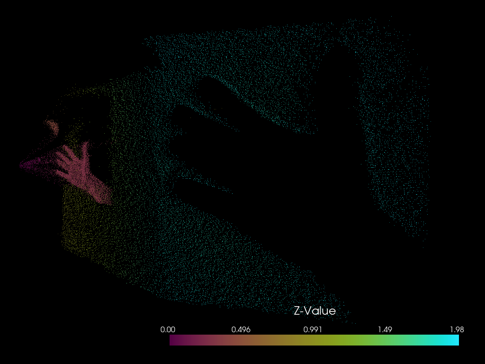

# Arducam TOF Camera Server and Client

This repository contains code for a server-client setup to capture and visualize depth and amplitude images from an Arducam TOF camera.

## Components

### Server
- **Server**: Runs on a Raspberry Pi with the Arducam TOF camera connected.
- **Functionality**: Captures depth and amplitude images upon client request.

### Client
- **Client**: Runs on a separate machine (e.g., laptop/desktop).
- **Functionality**: Receives depth and amplitude images from the server, generates a 3D point cloud, and visualizes it using PyVista.

